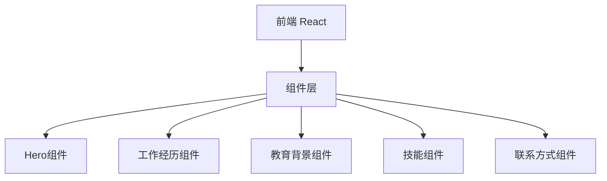

## 1. Architecture Design


## 2. Technology Description
- 前端: React@18 + tailwindcss@3 + vite
- 初始化工具: vite-init
- 后端: None (纯前端项目)

## 3. Route Definitions
| Route | Purpose |
|-------|---------|
| / | 首页 - 简历展示页 |

## 4. File Structure
```
src/
├── components/
│   ├── Hero.tsx          # Hero区域组件
│   ├── Experience.tsx    # 工作经历组件
│   ├── Education.tsx     # 教育背景组件
│   ├── Skills.tsx        # 技能组件
│   └── Contact.tsx      # 联系方式组件
├── pages/
│   └── Home.tsx         # 首页组件
├── App.tsx              # 主应用组件
└── main.tsx             # 入口文件
```

## 5. 核心组件说明
### 5.1 Hero 组件
- 展示个人姓名、职位、简介
- 圆形头像，带光晕效果
- 渐入动画

### 5.2 Experience 组件
- 时间线布局
- 左右交替卡片
- 悬停展开效果

### 5.3 Skills 组件
- 标签云展示
- 技能进度条
- 彩色区分技能分类

### 5.4 Contact 组件
- 网格布局
- 图标链接
- 悬停动画
