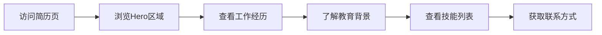

## 1. Product Overview
创建一个美观、专业的个人简历网页，用于面试展示。页面将展示个人信息、工作经历、教育背景、技能和联系方式，具备响应式设计和优雅的视觉效果。

## 2. Core Features

### 2.2 Feature Module
1. **首页 (简历展示页)**: 个人信息展示、工作经历、教育背景、技能列表、联系方式

### 2.3 Page Details
| Page Name | Module Name | Feature description |
|-----------|-------------|---------------------|
| 首页 | Hero区域 | 展示姓名、职位、简短简介和头像 |
| 首页 | 工作经历 | 时间线形式展示工作经验，包含公司名称、职位、工作时间、职责描述 |
| 首页 | 教育背景 | 展示学历信息，包括学校名称、专业、毕业时间 |
| 首页 | 技能列表 | 以卡片或标签形式展示技能，包含技术技能和软技能 |
| 首页 | 联系方式 | 提供邮箱、电话、GitHub、LinkedIn等联系方式 |

## 3. Core Process
用户访问简历网页 → 浏览Hero区域了解基本信息 → 向下滚动查看工作经历 → 了解教育背景和技能 → 通过联系方式区域获取更多信息

## 4. User Interface Design
### 4.1 Design Style
- 主色调：深蓝 (#1e3a8a) 配合白色背景，营造专业感
- 辅助色：橙色 (#f97316) 用于强调和交互效果
- 按钮风格：简洁的圆角矩形，悬停时有轻微的上浮效果
- 字体：使用 'Playfair Display' 作为标题字体，'Lato' 作为正文字体
- 布局风格：卡片式布局，带有微妙的阴影效果
- 图标风格：使用线性图标，简洁现代

### 4.2 Page Design Overview
| Page Name | Module Name | UI Elements |
|-----------|-------------|-------------|
| 首页 | Hero区域 | 居中布局，大标题，渐变背景，头像采用圆形设计，带有微妙的动画效果 |
| 首页 | 工作经历 | 时间线布局，左右交替的卡片，悬停时展开详细内容 |
| 首页 | 教育背景 | 简洁的卡片列表，每个卡片有轻微的阴影和悬停效果 |
| 首页 | 技能列表 | 彩色标签云，带有进度条展示熟练程度 |
| 首页 | 联系方式 | 网格布局，图标加文字，点击可直接操作 |

### 4.3 Responsiveness
采用桌面优先设计，同时适配平板和移动端，确保在各种屏幕尺寸下都有良好的展示效果。

### 4.4 交互效果
- 页面加载时的渐入动画
- 滚动时的元素展示动画
- 卡片和按钮的悬停效果
- 平滑滚动效果
